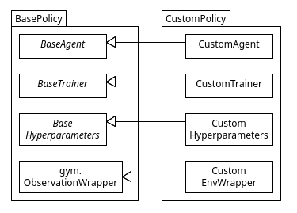

# MineRL Competition Baseline

 

This codebase provides a baseline for the MineRL competition. You can read more about this competition [here](https://minerl.io/). It has been created with extensibility in mind, meaning we highly encourage anyone interested to clone this repository and use it as a starting point for your Reinforcement Learning (RL) endeavours, be it for the MineRL competition, or something else exciting. It supports interaction with all gym environments (see more about these [here](https://www.gymlibrary.dev/)).

## About this Project

This project has been created to offer a robust and reliable baseline for creating, training and evaluating RL policies. We have provided an easily extensible and highly maintainable interface for implementing custom RL agents, trainers, memory buffers and neural networks. Whether you are just starting out in the world of RL, or you are someone with experience, this codebase will allow you to design and implement the components required for an RL policy, from simple through to advanced. We suggest you refer to this readme in order to understand how this can be done, and how the supplied scripts can be run to train and test your custom policies.

## Utilising the Provided Scripts

There are several scripts that are provided with this codebase that allow you to complete the following:

- Train the policy
- Evaluate the policy
- Pretrain any neural networks being used
- Convert a dataset (this is for the MineRL human expert dataset specifically)
- Visualise the state space being fed into the model/s

Let's look at how the two main scripts, training and evaluating, can be used. Please note that the information provided below should give insight into how to use the other scripts mentioned above.

### Train Script

The train script supports argument parsing when running from the CLI. The following details the arguments that can be passed to the script.

```sh
--policy policy_name		# This is defined inside of the train script, and specifies the policy being trained
--env gym_env_string		# This is the environment string that is used to make the gym env instance 
--wandb				# Use this if you would like the training data plotted to Weights and Biases
--no-wandb			# Use this if you would not like the training data plotted to Weights and Biases 
--gpu				# Use this if you would like the model training to occur on your GPU
--no-gpu			# Use this if you would like the model training to occur on your CPU
--human-exp-path		# The path to human data that will be used in training (optional)
--load-path			# The path to a saved agent that can be loaded to continue training (optional)
--human_exp_path		# The path to human data that will be used in training (optional)
--render  			# Specifies if the environment should be rendered to the screen during training
```

An example of running the training script is as follows:

```sh
python src/scripts/train.py --policy minerl-dqn --env MineRLNavigateDense-v0 --wandb --gpu
```

**Hint: Check the argument defaults in the train script to save you time when running.**

### Evaluate Script

```sh
--env gym_env_string		# This is the environment string that is used to make the gym env instance 
--gpu				# Use this if you would like the model evaluation to occur on your GPU
--no-gpu		        # Use this if you would like the model evaluation to occur on your CPU
--eval-episodes			# The number of episodes to evaluate the model
--weights-path			# The path to the agent being evaluated
--ep-rew-pass			# The episode reward threshold required for it to be considered a solved episode
--repeat-act  			# The number of times each action selected by the agent should be passed to the env
--csv-file-path			# The file path where a csv will be created containing useful metrics
--mp4-file-path			# The file path where the mp4 videos of the agent will be stored
```

An example of running the training script is as follows:

```sh
python src/scripts/evaluate.py --env CartPole-v0 --gpu --weights_path path/to/weights --ep_rew_pass 200
```

**Hint: Check the argument defaults in the evaluate script to save you time when running.**

## Creating Custom Policies

In the train script you will see that there is a section where a custom Policy can be created in the form of a named tuple. They take the following form:

```python
"policy-name": Policy(AgentClass, TrainerClass, wrapperBuilder, HyperparametersClass)
```

To create custom agents, trainers, wrappers and hyperparameters for your own policy, you can override the supplied base classes. These base classes come with a great deal of documentation that we encourage you to read! The following UML diagram visually details how a custom policy, and its components, can be created.



## Running with Docker

To run with docker simply run the following commands in the project root directory.

```sh
docker build . -t <image_name>		# This will build the image locally
docker run -d <image_name>		# Runs the container in detached mode
```

